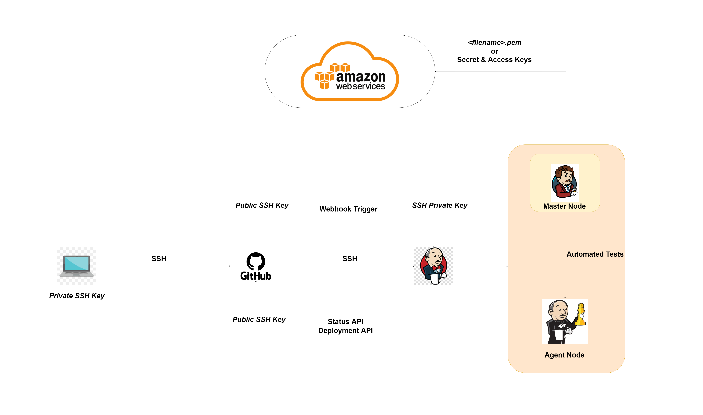

# Continuous Integration/Continuous Deployment (CD/CD)

## Table of Contents

- [Continuous Integration/Continuous Deployment (CD/CD)](#continuous-integrationcontinuous-deployment-cdcd)
  - [Table of Contents](#table-of-contents)
  - [What is CI/CD?](#what-is-cicd)
  - [What is Jenkins?](#what-is-jenkins)
  - [Step-by-step Guide](#step-by-step-guide)
    - [Step 1: Create SSH connection from localhost to GitHub](#step-1-create-ssh-connection-from-localhost-to-github)
    - [Step 2: Login and build job with Jenkins](#step-2-login-and-build-job-with-jenkins)
    - [Add Post build actions](#add-post-build-actions)

## What is CI/CD?

CI/CD is a method to frequently deliver apps to customers by introducing automation into the stages of app development. The main concepts attributed to CI/CD are continuous integration, continuous delivery, and continuous deployment. CI/CD is a solution to the problems integrating new code can cause for development and operations teams (AKA "integration hell").

Specifically, CI/CD introduces ongoing automation and continuous monitoring throughout the lifecycle of apps, from integration and testing phases to delivery and deployment. Taken together, these connected practices are often referred to as a "CI/CD pipeline" and are supported by development and operations teams working together in an agile way with either a DevOps or site reliability engineering (SRE) approach.

## What is Jenkins?

## Step-by-step Guide

### Step 1: Create SSH connection from localhost to GitHub

Follow [this guide](https://docs.github.com/en/authentication/connecting-to-github-with-ssh/generating-a-new-ssh-key-and-adding-it-to-the-ssh-agent) to create and connect your SSH key to GitHub.

In case the key is not recognized, do `ssh-add ~/.ssh/<key-filename>` to add the identity of the key.

### Step 2: Login and build job with Jenkins

- Login into Jenkins
- Click on New Item
- Click on "Create New Job" and name it
- Choose the Type of job you want to create (freestyle job) and click ok
- Add a `description`
- Select `Discard Old Build`
- For the `Max Number of Builds` choose 3
- `Source code management`: `git`
- No build triggers
- No build environment
- Under `Build` add Build steps and choose `Execute shell`
- Type in the script you wan to be run
- You can also add [Post build Actions](#add-post-build-actions)
- Apply and Save. This returns you to your project
- Click on `Build Now` (left hand side)
- Check version in `Build History` and check the `Console Output`
- Check if `SUCCESS` in Logs

### Add Post build actions

- For your build in Dashboard, open the dropdown
- Choose configure
- Go to post build actions
- Choose the job you want to build if condition is met.
