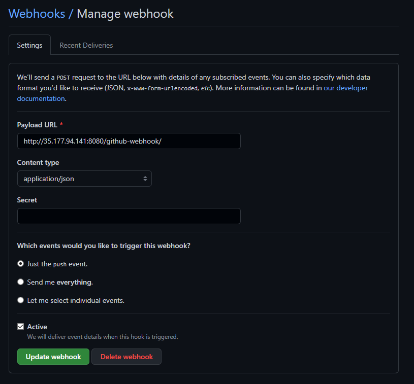

# Continuous Integration/Continuous Deployment (CD/CD)


## Table of Contents

- [Continuous Integration/Continuous Deployment (CD/CD)](#continuous-integrationcontinuous-deployment-cdcd)
  - [Table of Contents](#table-of-contents)
  - [What is CI/CD?](#what-is-cicd)
  - [What is Jenkins?](#what-is-jenkins)
  - [Step-by-step Guide](#step-by-step-guide)
    - [Step 1: Create SSH connection from localhost to GitHub](#step-1-create-ssh-connection-from-localhost-to-github)
    - [Step 2: Login and build job with Jenkins](#step-2-login-and-build-job-with-jenkins)
    - [Add Post build actions](#add-post-build-actions)
    - [Sync your Jenkins and GitHub with SSH](#sync-your-jenkins-and-github-with-ssh)
    - [Sync Jenkins job with Github](#sync-jenkins-job-with-github)
    - [Create GitHub webhook](#create-github-webhook)

## What is CI/CD?

CI/CD is a method to frequently deliver apps to customers by introducing automation into the stages of app development. The main concepts attributed to CI/CD are continuous integration, continuous delivery, and continuous deployment. CI/CD is a solution to the problems integrating new code can cause for development and operations teams (AKA "integration hell").

Specifically, CI/CD introduces ongoing automation and continuous monitoring throughout the lifecycle of apps, from integration and testing phases to delivery and deployment. Taken together, these connected practices are often referred to as a "CI/CD pipeline" and are supported by development and operations teams working together in an agile way with either a DevOps or site reliability engineering (SRE) approach.

## What is Jenkins?

## Step-by-step Guide

### Step 1: Create SSH connection from localhost to GitHub

Follow [this guide](https://docs.github.com/en/authentication/connecting-to-github-with-ssh/generating-a-new-ssh-key-and-adding-it-to-the-ssh-agent) to create and connect your SSH key to GitHub.

In case the key is not recognized, do `ssh-add ~/.ssh/<key-filename>` to add the identity of the key.

### Step 2: Login and build job with Jenkins

- Login into Jenkins
- Click on New Item
- Click on "Create New Job" and name it
- Choose the Type of job you want to create (freestyle job) and click ok
- Add a `description`
- Select `Discard Old Build`
- For the `Max Number of Builds` choose 3
- `Source code management`: `git`
- No build triggers
- No build environment
- Under `Build` add Build steps and choose `Execute shell`
- Type in the script you wan to be run
- You can also add [Post build Actions](#add-post-build-actions)
- Apply and Save. This returns you to your project
- Click on `Build Now` (left hand side)
- Check version in `Build History` and check the `Console Output`
- Check if `SUCCESS` in Logs

### Add Post build actions

- For your build in Dashboard, open the dropdown
- Choose configure
- Go to post build actions
- Choose the job you want to build if condition is met.

### Sync your Jenkins and GitHub with SSH

- Create new SSH key
- On github in your repo, go to `Settings -> Deployed Keys`
- Add new key and paste the contents of your `<key>.pub`.
- Create and test basic job on Jenkins (just something that prints `uname` and/or `date`)
- [Sync Jenkins job with Github](#sync-jenkins-job-with-github)
- [Add webhook on GitHub](#create-github-webhook)

### Sync Jenkins job with Github

- Go to your job in Jenkins
- Choose `Configure`
- In `General` tick `GitHub project` and add the `Project url`. Example (`https://github.com/ttudorandrei/cicd-pipeline-jenkins.git/`)
- Under `Office 365 Connector` tick `Restrict where this project can be run` and choose the `sparta-ubuntu-node` (or the node you need)
- Under `Source Code Management` choose `Git`
- Add the repo URL. Example: `git@github.com:ttudorandrei/cicd-pipeline-jenkins.git`
- Add your key in `Credentials` and then choose it from the dropdown.
- Choose the branch to build (main)
- Under `Build Environment` tick `Provide Node & npm bin/ folder to PATH` (already provided)
- Execute shell. In this case it was
  ```
  cd app
  npm install
  npm test
  ```
- Apply and Save

### Create GitHub webhook

- Go to GitHub repository
- Go to `Settings -> Webhooks`
- Get your Jenkins url and add `/github-webhook/` at the end. Example `http://35.177.94.141:8080/github-webhook/`
- For content type choose `application/json`
- Choose `just push the event` and tick `active`
- Save webhook and go to Jenkins build
- Under `Build Triggers` tick `GitHub hook trigger for GITScm polling`
  
